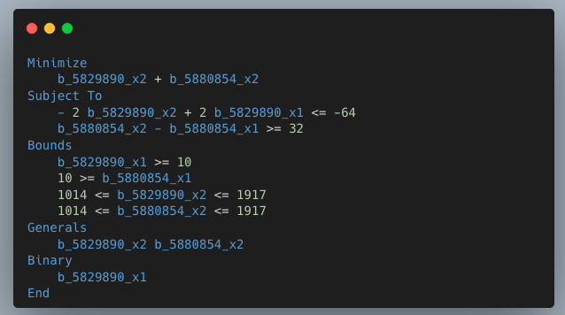

# LP File Parser

[](https://github.com/dandxy89/congenial-enigma/actions/workflows/cargo_test.yml)
[](https://crates.io/crates/lp_parser_rs)
[](https://docs.rs/lp_parser_rs/)

## Overview



A custom Rust LP file parser - this crate leverages the [PEST](https://docs.rs/pest/latest/pest/) crate for parsing LP files. It is designed and adhering to the following specifications:

- [IBM v22.1.1 Specification](https://www.ibm.com/docs/en/icos/22.1.1?topic=cplex-lp-file-format-algebraic-representation)
- [Fico](https://www.fico.com/fico-xpress-optimization/docs/dms2020-03/solver/optimizer/HTML/chapter10_sec_section102.html)
- [Gurobi](https://www.gurobi.com/documentation/current/refman/lp_format.html)

Try it out using the following command line;

```bash
git clone https://github.com/dandxy89/lp_parser_rs.git &&
    cargo run -- {{PATH_TO_FILE}}
```

## Supported LP Specifications

- Problem Name
- Problem Sense
- Objectives
  - Single-Objective Case
  - Multi-Objective Case
- Constraints
- Bounds
- Variable Types: Integer, Generals, Lower Bounded, Upper Bounded, Free & Upper and Lower Bounded
- Semi-continuous
- Special Order Sets (SOS)

## Crate Features

- `serde`: Adds `Serde` annotations to each of the model Structs and Enums.
- `diff`: Adds capability to diff two Structs

## Acknowledgments

Test data has been copied from other similar or related projects:

- [Sebastian/jplex](https://github.com/asbestian/jplex/blob/main/instances/afiro.lp)
- [Odow/LPWriter.jl](https://github.com/odow/LPWriter.jl/blob/master/test/model2.lp)
- [Aphi/Lp-Parser](https://github.com/aphi/Lp-Parser)

### Testers and Contributors

This crate utilized `insta` for snapshot testing.

```bash
cargo insta test --all-features # Run all tests
cargo insta review # Review any changes to the snapshots
```

- [Ahenshaw](https://github.com/ahenshaw)
